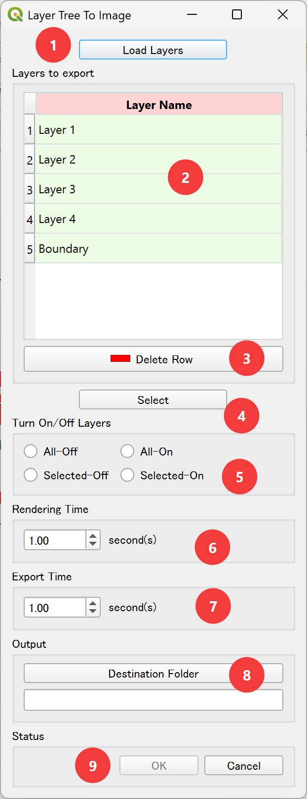

# Layer Tree to Image Plugin

This plugin exports the layers in the QGIS canvas into PNGs. Users can export all layers or only selected layers as PNGs. It is useful when the user wants to create a movie to animate the temporal change without having a timestamp column in the GIS data.

## How to Use

1. Load Layers: Load all the layers in the table of contents (layer tree) into the tool.
2. Layers to Export: This table shows all the layers that the user needs to export. If the user does not want to export a layer so that it is always visible, remove that layer from the Layers to Export table.
3. Delete Row: remove any layer that the user does not want to export so that it is always visible. For example, the user may need to keep the boundary always visible; in this case, the user can select the boundary layer and delete it. 
4. Select: This button selects all the layers in the table of contents shown in the Layers to Export Table in step 2.
5. Turn On/Off Layers: Users control whether they want to turn off the layers if they are visible, or vice versa. Generally, users will turn off the selected layers most of the time since they are visible in the canvas.
6. Rendering Time: The time required to render the layer in the canvas. For simple layers, 1 second is enough.
7. Export Time: The time required to export the layer in the canvas. For simple layers, 1 second is enough.
8. Destination Folder: The folder path where the PNGs will be saved.
9. OK/Cancel Button: To execute the export process or cancel it.
